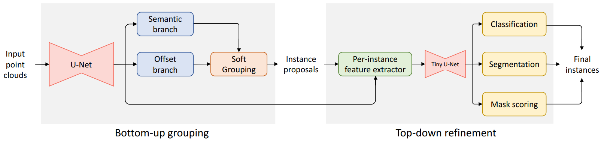
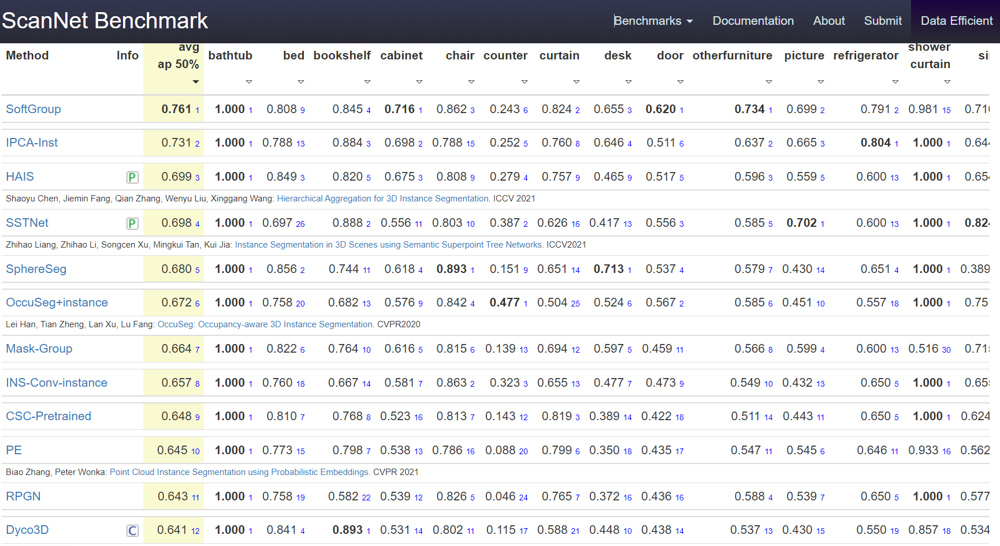

# SoftGroup
[](https://paperswithcode.com/sota/3d-instance-segmentation-on-scannetv2?p=softgroup-for-3d-instance-segmentation-on) [](https://paperswithcode.com/sota/3d-instance-segmentation-on-s3dis?p=softgroup-for-3d-instance-segmentation-on) [](https://paperswithcode.com/sota/3d-object-detection-on-scannetv2?p=softgroup-for-3d-instance-segmentation-on)


We provide code for reproducing results of the paper [**SoftGroup for 3D Instance Segmentation on Point Clouds (CVPR 2022 Oral)**](https://arxiv.org/abs/2203.01509)

Author: Thang Vu, Kookhoi Kim, Tung M. Luu, Xuan Thanh Nguyen, and Chang D. Yoo.

## Update
- 16/Apr/2022: The code base is refactored. Coding is more extendable, readable, and consistent. The following features are supported:
  - Support up-to-date pytorch 1.11 and spconv 2.1.
  - Support distributed and mix precision training. Training time on ScanNet v2 (on 4GPUs) reduces from 4 day to 10 hours.
  - Faster inference speed, which requires only 288 ms per ScanNet scan on single Titan X.

## Introduction

Existing state-of-the-art 3D instance segmentation methods perform semantic segmentation followed by grouping. The hard predictions are made when performing semantic segmentation such that each point is associated with a single class. However, the errors stemming from hard decision propagate into grouping that results in (1) low overlaps between the predicted instance with the ground truth and (2) substantial false positives. To address the aforementioned problems, this paper proposes a 3D instance segmentation method referred to as SoftGroup by performing bottom-up soft grouping followed by top-down refinement. SoftGroup allows each point to be associated with multiple classes to mitigate the problems stemming from semantic prediction errors and suppresses false positive instances by learning to categorize them as background. Experimental results on different datasets and multiple evaluation metrics demonstrate the efficacy of SoftGroup. Its performance surpasses the strongest prior method by a significant margin of +6.2% on the ScanNet v2 hidden test set and +6.8% on S3DIS Area 5 of AP_50.



## Feature
* State of the art performance on the [ScanNet benchmark](http://kaldir.vc.in.tum.de/scannet_benchmark/semantic_instance_3d) and S3DIS dataset (3/Mar/2022).
* High speed of 345 ms per scan on ScanNet dataset, which is comparable with the existing fastest methods ([HAIS](https://github.com/hustvl/HAIS)).
* Reproducibility code for both ScanNet and S3DIS datasets.

## Installation
Please refer to [installation guide](docs/installation.md).

## Data Preparation
Please refer to [data preparation](dataset/README.md) for preparing the S3DIS and ScanNet v2 dataset.

## Pretrained models


|   Dataset  |  AP  | AP_50 | AP_25 | Bbox AP_50 | Bbox AP_25 |                                           Download                                          |
|:----------:|:----:|:-----:|:-----:|:-----:|:-----:|:-------------------------------------------------------------------------------------------:|
|    S3DIS   | 51.4 |  66.5 |  75.4 |  -    |  -    | [model](https://drive.google.com/file/d/1-f7I6-eIma4OilBON928N6mVcYbhiUFP/view?usp=sharing) |
| ScanNet v2 | 46.0 |  67.6 |  78.9 |  59.4 |  71.6 | [model](https://drive.google.com/file/d/1XUNRfred9QAEUY__VdmSgZxGQ7peG5ms/view?usp=sharing) |

## Training
We use the checkpoint of [HAIS](https://github.com/hustvl/HAIS) as pretrained backbone. **We have already converted the checkpoint to work on ``spconv2.x``**. Download the pretrained HAIS-spconv2 model and put it in ``SoftGroup/`` directory.

Converted hais checkpoint: [model](https://drive.google.com/file/d/1FABsCUnxfO_VlItAzDYAwurdfcdK-scs/view?usp=sharing)
### Training S3DIS dataset
The default configs suppose training on 4 GPU. If you use smaller number of GPUs, you should reduce the learning rate linearly. 

First, finetune the pretrained HAIS point-wise prediction network (backbone) on S3DIS.
```
./tools/dist_train.sh configs/softgroup_s3dis_backbone_fold5.yaml 4
```
Then, train model from frozen backbone.
```
./tools/dist_train.sh configs/softgroup_s3dis_fold5.yaml 4
```

### Training ScanNet V2 dataset
Training on ScanNet doesnot require finetuning the backbone. Just freeze pretrained backbone and train the model.
```
./tools/dist_train.sh configs/softgroup_scannet.yaml 4
```

## Inference
```
./tools/dist_test.sh $CONFIG_FILE $CHECKPOINT $NUM_GPU
```
### Bounding box evaluation of ScanNet V2 dataset.
We provide script to evaluate detection performance on axis-aligned boxes from predicted/ground-truth instance.
- Step 1: Change ``save_instance`` to ``True`` in [config file](https://github.com/thangvubk/SoftGroup/blob/99ffb9756e553e0edfb2c43e2ab6a6f646892bb5/config/softgroup_default_scannet.yaml#L72).
- Step 2: Run evaluation code.
```
CUDA_VISIBLE_DEVICES=0 python test.py --config config/softgroup_default_scannet.yaml --pretrain $PATH_TO_PRETRAIN_MODEL$
```
- Step 3: Evaluate detection performance.
```
python eval_det.py
```

## Visualization
Please refer to [visualization guide](docs/visualization.md) for visualizing ScanNet and S3DIS results.


## Citation
If you find our work helpful for your research. Please consider citing our paper.

```
@inproceedings{vu2022softgroup,
  title={SoftGroup for 3D Instance Segmentation on 3D Point Clouds},
  author={Vu, Thang and Kim, Kookhoi and Luu, Tung M. and Nguyen, Xuan Thanh and Yoo, Chang D.},
  booktitle={CVPR},
  year={2022}
}
```
## References
Code is built based on [HAIS](https://github.com/hustvl/HAIS), [PointGroup](https://github.com/dvlab-research/PointGroup), and [spconv](https://github.com/traveller59/spconv)
