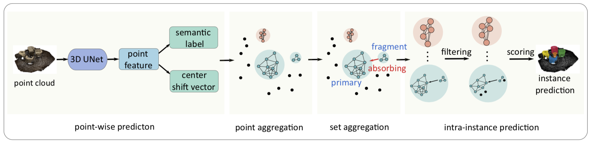
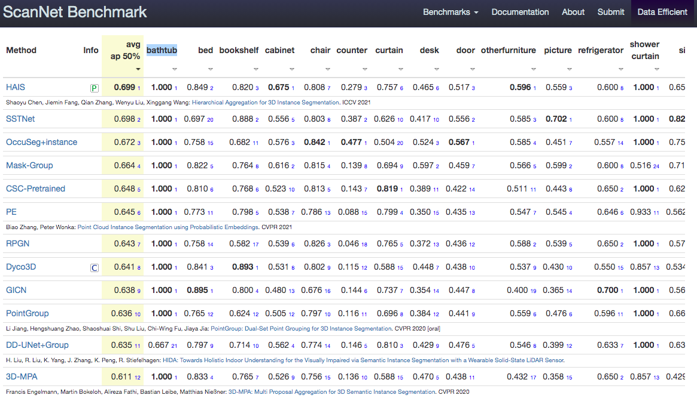

# HAIS

[](https://paperswithcode.com/sota/3d-instance-segmentation-on-scannetv2?p=hierarchical-aggregation-for-3d-instance) [](https://paperswithcode.com/sota/3d-instance-segmentation-on-s3dis?p=hierarchical-aggregation-for-3d-instance)

## SoftGroup for 3D Instance Segmentation on Point Clouds (CVPR 2022)


by Thang Vu, Kookhoi Kim, Tung M. Luu, Xuan Thanh Nguyen, and Chang D. Yoo.
[

<div align="center">


</div>

<br>


## Introduction

Existing state-of-the-art 3D instance segmentation methods perform semantic segmentation followed by grouping. The hard predictions are made when performing semantic segmentation such that each point is associated with a single class. However, the errors stemming from hard decision propagate into grouping that results in (1) low overlaps between the predicted instance with the ground truth and (2) substantial false positives. To address the aforementioned problems, this paper proposes a 3D instance segmentation method referred to as SoftGroup by performing bottom-up soft grouping followed by top-down refinement. SoftGroup allows each point to be associated with multiple classes to mitigate the problems stemming from semantic prediction errors and suppresses false positive instances by learning to categorize them as background. Experimental results on different datasets and multiple evaluation metrics demonstrate the efficacy of SoftGroup. Its performance surpasses the strongest prior method by a significant margin of +6.2% on the ScanNet v2 hidden test set and +6.8% on S3DIS Area 5 in terms of AP_50.
  


* **High performance**. HAIS [ranks 1st](http://kaldir.vc.in.tum.de/scannet_benchmark/semantic_instance_3d) on the [ScanNet benchmark](http://kaldir.vc.in.tum.de/scannet_benchmark/semantic_instance_3d) (Aug. 8th, 2021).



* **High speed**. Thanks to the NMS-free and single-forward inference design, HAIS achieves the best inference speed among all existing methods. HAIS only takes **206 ms** on RTX 3090 and **339 ms** on TITAN X.


|  Method   | Per-frame latency on TITAN X|
| :-: | :-: |
|ASIS|181913 ms|
|SGPN|158439 ms|
|3D-SIS|124490 ms|
|GSPN|12702 ms|
|3D-BoNet|9202 ms|
|GICN|8615 ms|
|OccuSeg|1904 ms|
|PointGroup|452 ms|
|**HAIS**|**339 ms**|

[[ICCV21 presentation]](https://drive.google.com/file/d/1zDBqMBHrB077VbJUZdMY1D0LbtdjgpSi/view?usp=sharing)


## Update

#### 2021.9.30: 
* Code is released.
* With better CUDA optimization, HAIS now only takes 339 ms on TITAN X, much better than the latency reported in the paper (410 ms on TITAN X).


## Installation

1\) Environment

* Python 3.x
* Pytorch 1.1 or higher
* CUDA 9.2 or higher
* gcc-5.4 or higher

Create a conda virtual environment and activate it.
```
conda create -n hais python=3.7
conda activate hais
```


2\) Clone the repository.
```
git clone https://github.com/hustvl/HAIS.git --recursive
```

  
3\) Install the requirements.
```
cd HAIS
pip install -r requirements.txt
conda install -c bioconda google-sparsehash 
```

4\) Install spconv 

*  Verify the version of spconv.
  
      spconv 1.0, compatible with CUDA < 11 and pytorch < 1.5, is already recursively cloned in `HAIS/lib/spconv` in step 2) by default. 

      For higher version CUDA and pytorch, spconv 1.2 is suggested. Replace `HAIS/lib/spconv` with this fork of spconv.

```
git clone https://github.com/outsidercsy/spconv.git --recursive
```

      Note:  In the provided spconv 1.0 and 1.2, spconv\spconv\functional.py is modified to make grad_output contiguous. Make sure you use the modified spconv but not the original one. Or there would be some bugs of optimization.


*  Install the dependent libraries.
```
conda install libboost
conda install -c daleydeng gcc-5 # (optional, install gcc-5.4 in conda env)
```

* Compile the spconv library.
```
cd HAIS/lib/spconv
python setup.py bdist_wheel
```

* Intall the generated .whl file.
```
cd HAIS/lib/spconv/dist
pip install {wheel_file_name}.whl
```


5\) Compile the external C++ and CUDA ops.
```
cd HAIS/lib/hais_ops
export CPLUS_INCLUDE_PATH={conda_env_path}/hais/include:$CPLUS_INCLUDE_PATH
python setup.py build_ext develop
```
{conda_env_path} is the location of the created conda environment, e.g., `/anaconda3/envs`.


## Data Preparation

1\) Download the [ScanNet](http://www.scan-net.org/) v2 dataset.

2\) Put the data in the corresponding folders. 
* Copy the files `[scene_id]_vh_clean_2.ply`,  `[scene_id]_vh_clean_2.labels.ply`,  `[scene_id]_vh_clean_2.0.010000.segs.json`  and `[scene_id].aggregation.json`  into the `dataset/scannetv2/train` and `dataset/scannetv2/val` folders according to the ScanNet v2 train/val [split](https://github.com/ScanNet/ScanNet/tree/master/Tasks/Benchmark). 

* Copy the files `[scene_id]_vh_clean_2.ply` into the `dataset/scannetv2/test` folder according to the ScanNet v2 test [split](https://github.com/ScanNet/ScanNet/tree/master/Tasks/Benchmark). 

* Put the file `scannetv2-labels.combined.tsv` in the `dataset/scannetv2` folder.

The dataset files are organized as follows.
```
HAIS
├── dataset
│   ├── scannetv2
│   │   ├── train
│   │   │   ├── [scene_id]_vh_clean_2.ply & [scene_id]_vh_clean_2.labels.ply & [scene_id]_vh_clean_2.0.010000.segs.json & [scene_id].aggregation.json
│   │   ├── val
│   │   │   ├── [scene_id]_vh_clean_2.ply & [scene_id]_vh_clean_2.labels.ply & [scene_id]_vh_clean_2.0.010000.segs.json & [scene_id].aggregation.json
│   │   ├── test
│   │   │   ├── [scene_id]_vh_clean_2.ply 
│   │   ├── scannetv2-labels.combined.tsv
```

3\) Generate input files `[scene_id]_inst_nostuff.pth` for instance segmentation.
```
cd HAIS/dataset/scannetv2
python prepare_data_inst.py --data_split train
python prepare_data_inst.py --data_split val
python prepare_data_inst.py --data_split test
```

## Training
```
CUDA_VISIBLE_DEVICES=0 python train.py --config config/hais_run1_scannet.yaml 
```


## Inference

1\) To evaluate on validation set, 

* prepare the `.txt` instance ground-truth files as the following.
```
cd dataset/scannetv2
python prepare_data_inst_gttxt.py
```

* set `split` and `eval` in the config file as `val` and `True`. 
  
* Run the inference and evaluation code.
```
CUDA_VISIBLE_DEVICES=0 python test.py --config config/hais_run1_scannet.yaml --pretrain $PATH_TO_PRETRAIN_MODEL$
```


Pretrained model: [Google Drive](https://drive.google.com/file/d/1XGNswNrbjm33SwpemYxVEoK4o46EOazd/view?usp=sharing) / [Baidu Cloud](https://pan.baidu.com/s/12dx-39jBOyU9QzGlpgJ8OQ) [code: sh4t].
mAP/mAP50/mAP25 is 44.1/64.4/75.7.


2\) To evaluate on test set, 

* Set (`split`, `eval`, `save_instance`) as (`test`, `False`, `True`). 
* Run the inference code. Prediction results are saved in `HAIS/exp` by default.
```
CUDA_VISIBLE_DEVICES=0 python test.py --config config/hais_run1_scannet.yaml --pretrain $PATH_TO_PRETRAIN_MODEL$
```

* Transform the prediction results into the [submission format](http://kaldir.vc.in.tum.de/scannet_benchmark/documentation).
* Submit the results to the [official evaluation server](http://kaldir.vc.in.tum.de/scannet_benchmark/submissions).


## Visualization
We provide visualization tools based on Open3D (tested on Open3D 0.8.0).
```
pip install open3D==0.8.0
python visualize_open3d.py --data_path {} --prediction_path {} --data_split {} --room_name {} --task {}
```
Please refer to `visualize_open3d.py` for more details.


## Acknowledgement
The code is based on [PointGroup](https://github.com/dvlab-research/PointGroup) and [spconv](https://github.com/traveller59/spconv).


## Contact
If you have any questions or suggestions about this repo, please feel free to contact me (shaoyuchen@hust.edu.cn).


## Citation
```
@InProceedings{Chen_2021_ICCV,
    author    = {Chen, Shaoyu and Fang, Jiemin and Zhang, Qian and Liu, Wenyu and Wang, Xinggang},
    title     = {Hierarchical Aggregation for 3D Instance Segmentation},
    booktitle = {Proceedings of the IEEE/CVF International Conference on Computer Vision (ICCV)},
    month     = {October},
    year      = {2021},
    pages     = {15467-15476}
}
```
